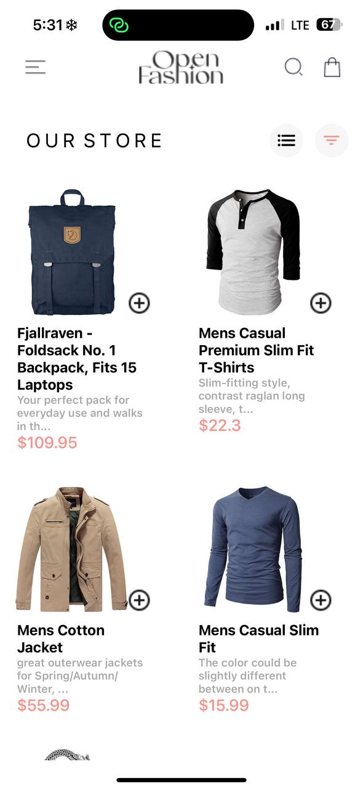
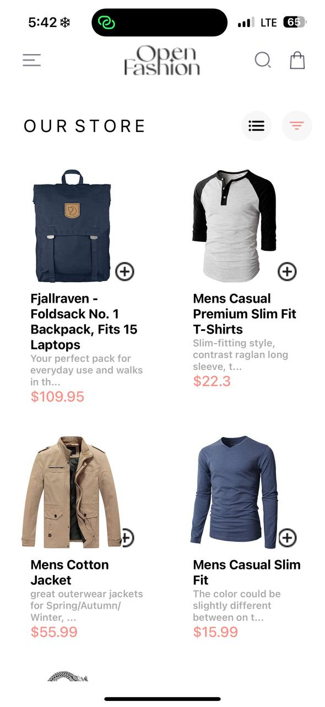
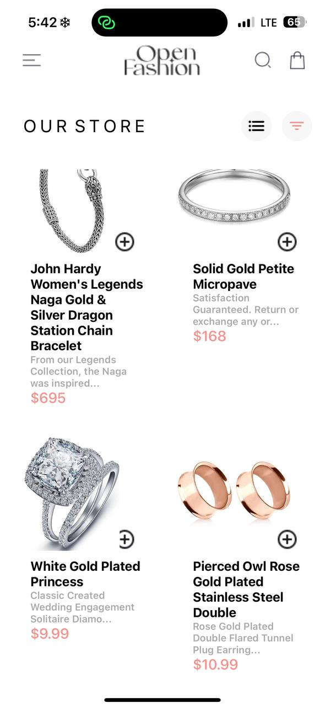
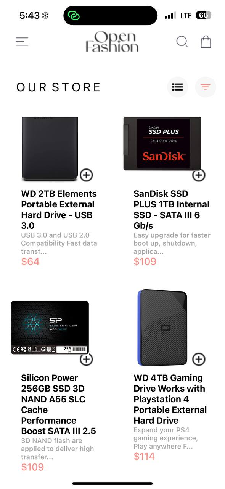
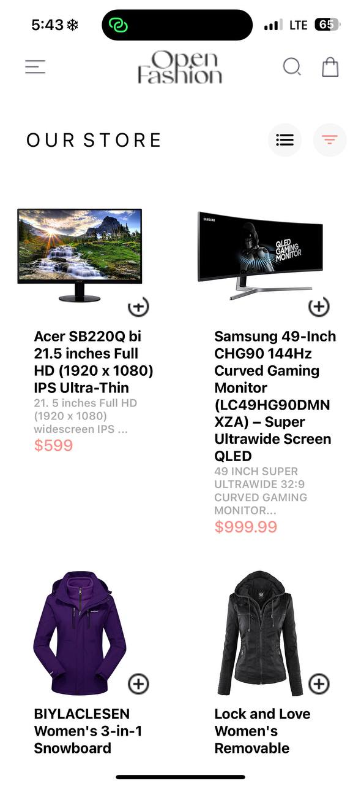
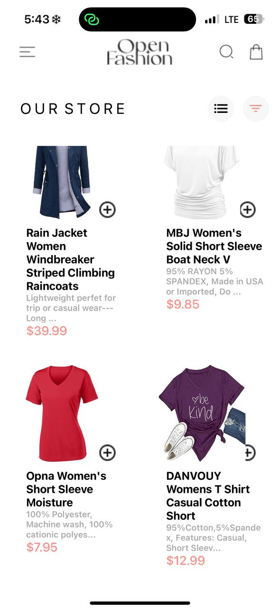
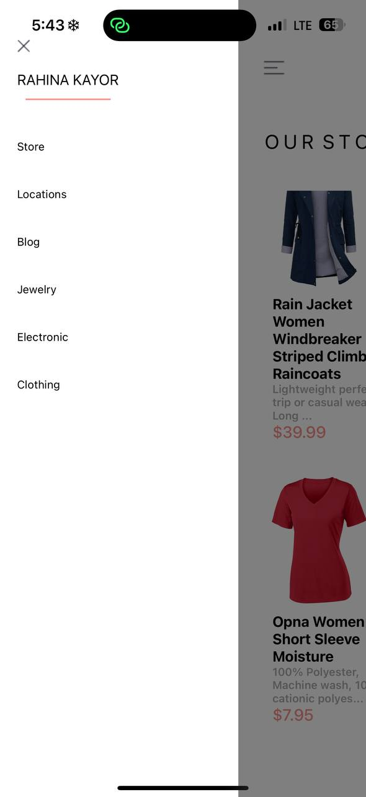
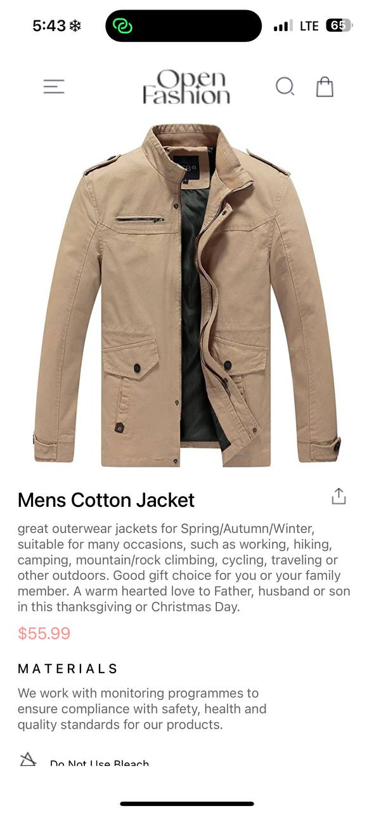
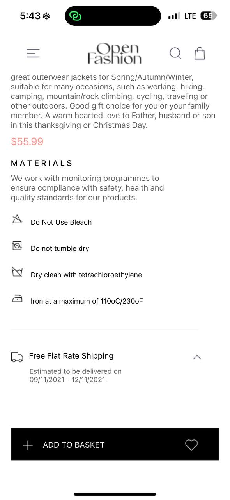
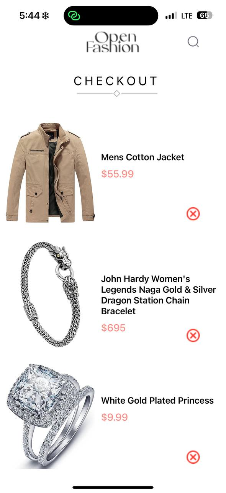

OVERVIEW
This project is a mobile application built using React Native. It features a shopping experience with navigation, a cart, and product details screens. The app is structured with a drawer navigation for different categories and a stack navigation within each category. It fetches product data from an external store API and allows users to add items to a cart, which is managed through a context.

FEATURESHome Screen: Displays a list of products fetched from a fake store API.
Product Details Screen: Shows detailed information about a selected product.
Cart Screen: Displays items added to the cart and allows for removal.
Drawer Navigation: Allows navigation between different categories.
Cart Management: Utilizes React Context and AsyncStorage for state management.

DESIGN CHOICES

NAVIGATION:
Used react-navigation for a combination of drawer and stack navigators to facilitate smooth navigation between different parts of the app.
Drawer navigation allows for easy access to different product categories.
Stack navigation within each category helps in navigating between the home screen, product details, and cart screens.

STATE MANAGEMENT:
Implemented context API (CartContext) to manage cart state globally across the app.
AsyncStorage is used for persisting the cart data, ensuring that cart items are not lost when the app is closed or refreshed.

STYLING:
Used StyleSheet for consistent and maintainable styling.
Ensured responsive design with a column layout for product listings, accommodating various screen sizes.

ERROR HANDLING:

Included basic error handling for data fetching and image loading.
Provided placeholder text and images to enhance user experience during loading times.
Implementation Details

APP COMPONENT:
The root component sets up the navigation container and drawer navigator.
Each drawer item is linked to a stack navigator that includes the home screen, cart screen, and product details screen.

SCREENSHOTS:

